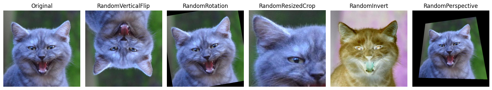
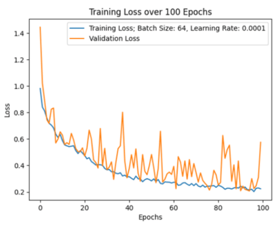
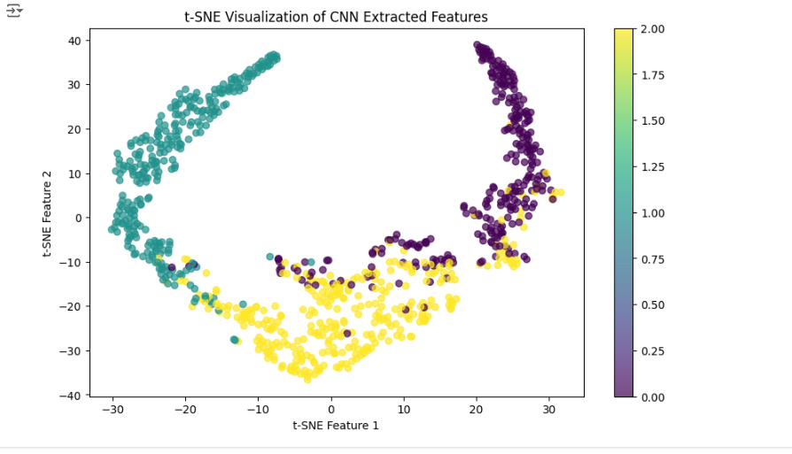
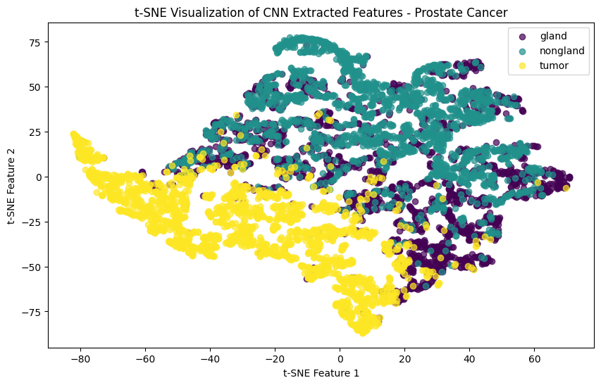
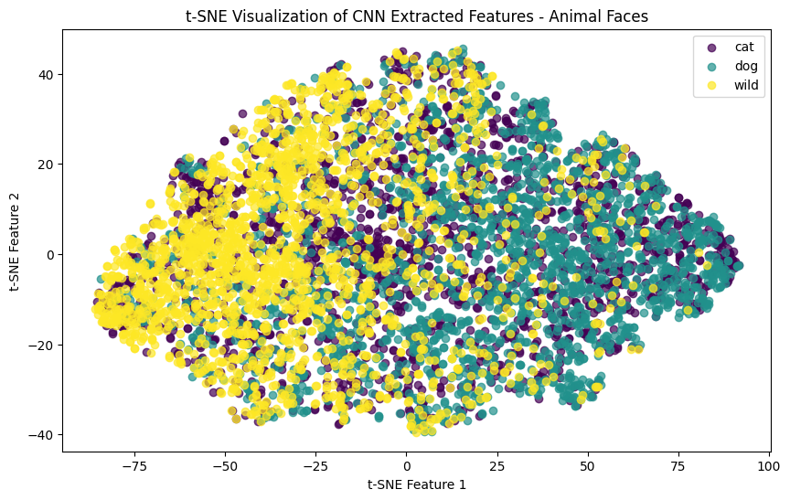
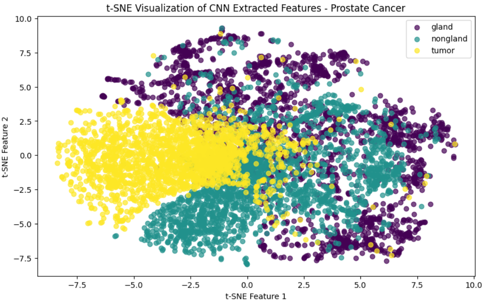
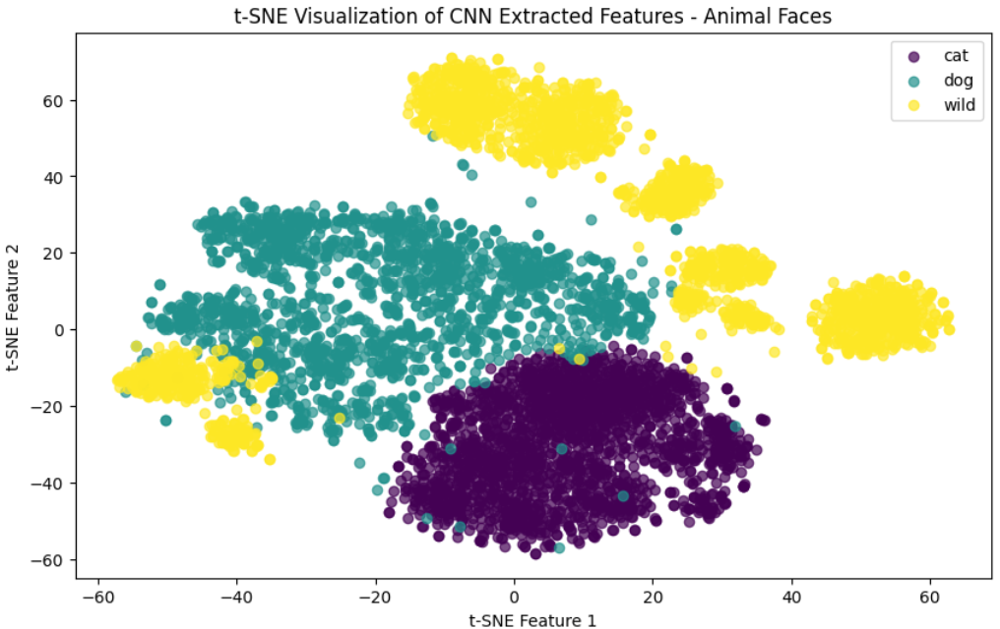

# COMP-432 Project

# Table of Contents

- [Project Description](#project-description)
    - [Task 1](#task-1)
    - [Task 2](#task-1)
- [Instructions on how to train and validate the model](#instructions-on-how-to-train-and-validate-the-model)
- [Instructions on how to run pre-trained model on sample dataset](#instructions-on-how-to-run-pre-trained-model-on-sample-dataset)
- [Dataset Links](#dataset-links)

## Project Description
This project focuses on using Convolutional Neural Networks (CNNs), for image classification tasks in the context of medical applications. For part 1 of the project, the goal is to train and evaluate a ResNet-34 model on a dataset consisting of Colorectal Cancer Images (MUS, NORM, STR). For part 2, the goal is to use the encoder obtained from part 1 and a pre-trained ImageNet (ShuffleNet) encoder on new datasets of Prostate Cancer and Animal Faces images for classification. In the end, the performance of these encoders shall be analyzed and compared.  
The project can be divided into two elements: Task 1 and Task 2.

### Task 1
This part focuses on the training, validtion, and testing of the ResNet-34 CNN. The dataset used contained 6000 images of tissues at a microscopic level realted to prostate cancer. It is divided into three classes: smooth muscle (MUS), normal colon mucosa (NORM), and cancer-associated stroma (STR). There are 2000 images for each class
in the dataset 
 
The code applies several image transformations at random to each image as part of a data augmentation process in order to compensate for such a small dataset. The image below shows a sample of the possible transformations an image can undergo. 

  

Training went through a total of 8 different attempts where the hyperparameters of our model (batch size, weight decay, learning rate) as well as the number of transformations were tuned until we arrived at a satisfactory result. The image below shows a plot of the training and validation losses for our final training attempt.

  

Afterwards, the model's trained weights were saved and t-SNE was used for dimensionality reduction of the output features. Below is a sample of the onbtained results.

  

### Task 2
This part consisted of applying analyzing the feature extraction capabilites of our trained model when applied to 2 new datasets, both with 6000 images as well.
The first one contains images of tissue related to prostate cancer at microscopic level, divided into 3, equally distributed classes: gland, non-gland, and tumor. The second dataset contains images of animal faces, evenly distributed across 3 separate classes as well: cat, dog, and wild.  
 
We first applied our trained encoder to the datasets with the following results

  

  

Afterwards, we repeated this procedure with a ShuffleNet V2 model that had been previously trained using the IMAGENET1K dataset. Below are the visualizations for the feature extraction perfomed.

  

  

From these results we can conclude that our model had a stronger perfomance separating features when it came to images in the medical domain, as seen by the visualization for t-SNE for the prostate cancer dataset, while it was beaten by the ShuffleNet model trained on the
IMAGENET1K dataset since that one contains images of animals such as the cats and dogs present in Dataset 3.

## Requirements
It is strongly recommended to run the code in google colab since it has been set up to download any necessary imports and the datasets themselves as each code cell is executed. Can be run in a python IDE or Jupyter but need to use custom path to the dataset folders.
- The following libraries are required to run the code:
    - os
    - numpy
    - matplotlib
    - sklearn
    - torch
    - torchvision
    - gdown to download the necessary datasets from Google Drive
 
Once again, it is strongly recommended to use Google Colab to run the notebooks since it will avoid the hassle of setting up everything properly.

## Instructions on how to train and validate the model
Use the [model training notebook](/Source%20Code%20ipynb%20files/Part%201/part1_model_training.ipynb). Run each code cell in the top to bottom order.

## Instructions on how to run pre-trained model on sample dataset
Use the [encoder from part 1](/Source%20Code%20ipynb%20files/Part%202/part2_encoder_from_part1.ipynb)
and the [pre-trained encoder](/Source%20Code%20ipynb%20files/Part%202/part2_shufflenet_encoder.ipynb)
Run each code cell in the top to bottom order. In some instances it may be required to comment out a line and uncomment another. This will be indicated above the code cell.

## Dataset Links:
The project datasets are downloaded when running the .ipynb notebooks in google collab. 

(Optional) The datasets can be downloaded from the following links and placed inside your project folder. The path in each file should be changed to the location of your datasets.

**Dataset 1: Colorectal Cancer Classification** 
    [Original Dataset](https://zenodo.org/record/1214456)
    | [Project Dataset](https://1drv.ms/u/s!AilzKc-njjP7mN0NOZvxl0TPAUxmig?e=K0TpeX)

**Dataset 2: Prostate Cancer Classification** 
    [Original Dataset](https://zenodo.org/record/4789576)
    | [Project Dataset](https://1drv.ms/u/s!AilzKc-njjP7mN0M_LjB5xeAydDsrA?e=0obzsx)

**Dataset 1: Animal Faces Classification** 
    [Original Dataset](https://www.kaggle.com/datasets/andrewmvd/animal-faces)
    | [Project Dataset](https://1drv.ms/u/s!AilzKc-njjP7mN0LqoRZvUYONY9sbQ?e=wxWbip)
